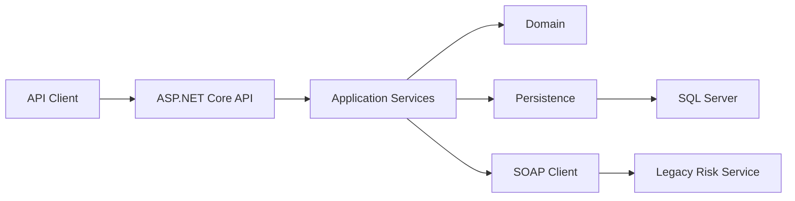
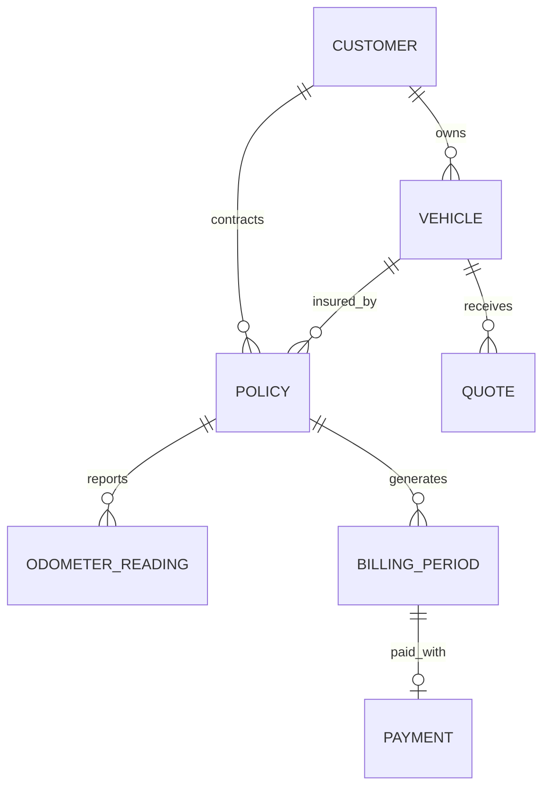

# KmPolicy API

Backend para la gestión de pólizas de seguro de automóvil basadas en kilometraje.

> **Estado:** En desarrollo.

KmPolicy API modela un dominio ficticio de seguros de automóvil por uso, donde una póliza puede asociarse a un vehículo, registrar lecturas periódicas de odómetro y generar cargos en función de la distancia recorrida.

Todas las reglas de negocio utilizadas en este proyecto son ficticias y no representan los procesos, tarifas o algoritmos de ninguna aseguradora real.

---

## Descripción

El sistema busca cubrir el ciclo principal de una póliza basada en kilometraje:

```text
Cliente
   ↓
Vehículo
   ↓
Cotización
   ↓
Póliza
   ↓
Lecturas de odómetro
   ↓
Cierre mensual
   ↓
Cargo
   ↓
Pago
```

Además del flujo principal REST, la arquitectura contempla una integración SOAP con un servicio externo ficticio de evaluación de riesgo.

---

## Funcionalidades previstas

### Clientes

Administración de la información necesaria para identificar al titular de una póliza.

### Vehículos

Registro de vehículos asociados a clientes y validación de datos relevantes para el dominio.

### Cotizaciones

Generación de cotizaciones mediante reglas de negocio ficticias basadas en características del vehículo y otros factores.

### Pólizas

Emisión y administración del ciclo de vida de una póliza.

Estados previstos:

```text
Draft
Active
Suspended
Cancelled
Expired
```

### Lecturas de odómetro

Registro periódico del kilometraje de un vehículo.

Entre las reglas de dominio previstas se encuentran:

* impedir que una lectura sea menor que la anterior;
* evitar cierres duplicados de un mismo periodo;
* aceptar periodos con cero kilómetros recorridos;
* identificar lecturas que requieran revisión.

### Facturación mensual

Cálculo del kilometraje recorrido durante un periodo:

```text
kilómetros recorridos =
odómetro actual - odómetro anterior
```

y posteriormente:

```text
cargo variable =
kilómetros recorridos × tarifa por kilómetro
```

### Pagos

Registro de pagos simulados asociados a estados de cuenta.

Estados previstos:

```text
Pending
Paid
Failed
Refunded
```

### Evaluación de riesgo

Integración con un servicio SOAP ficticio encargado de devolver una evaluación de riesgo para determinados vehículos.

Esta integración permitirá mantener separado el sistema principal REST de un servicio externo basado en SOAP/WSDL.

---

## Stack

El proyecto utilizará progresivamente:

### Backend

* C#
* .NET 10
* ASP.NET Core
* Entity Framework Core

### Base de datos

* SQL Server
* SQL
* Stored Procedures

### APIs e integraciones

* REST
* OpenAPI / Swagger
* SOAP
* WSDL

### Testing

* xUnit
* pruebas unitarias
* pruebas de integración
* Postman
* SoapUI

### Infraestructura

* Docker
* Docker Compose

### Observabilidad

* logging estructurado
* Serilog
* Correlation ID

> Algunas tecnologías de esta lista forman parte del roadmap y todavía pueden no estar implementadas en la rama principal.

---

## Arquitectura prevista

La solución mantendrá separadas las principales responsabilidades del sistema.

```text
src/
├── KmPolicy.Api/
├── KmPolicy.Application/
├── KmPolicy.Domain/
├── KmPolicy.Infrastructure/
└── KmPolicy.LegacyRiskSoap/

tests/
├── KmPolicy.UnitTests/
└── KmPolicy.IntegrationTests/

database/
├── procedures/
└── seed/

postman/
soapui/
docs/
```

La separación se introducirá progresivamente conforme cada componente sea necesario.

El objetivo no es aplicar una arquitectura por convención, sino mantener responsabilidades claras y evitar acoplamiento innecesario.

---

## Flujo de alto nivel



---

## Modelo de dominio

Entre las principales entidades previstas se encuentran:

```text
Customer
Vehicle
Quote
Policy
OdometerReading
BillingPeriod
Payment
RiskEvaluation
```

Relaciones principales:



---

## API prevista

Algunos de los endpoints considerados para el sistema son:

```http
POST   /api/customers
GET    /api/customers/{id}

POST   /api/vehicles
GET    /api/vehicles/{id}

POST   /api/quotes
GET    /api/quotes/{id}

POST   /api/policies
GET    /api/policies/{id}
PATCH  /api/policies/{id}/status

POST   /api/policies/{id}/odometer-readings
GET    /api/policies/{id}/odometer-readings

POST   /api/policies/{id}/billing-periods/close
GET    /api/policies/{id}/statements/{year}/{month}

POST   /api/payments
GET    /api/payments/{id}
```

La API evolucionará conforme avance el dominio. No todos los endpoints anteriores se encuentran implementados actualmente.

---

## Reglas de negocio

Algunas reglas previstas:

* un vehículo pertenece a un cliente;
* el número de identificación de un vehículo no debe duplicarse;
* una cotización tiene una vigencia determinada;
* una cotización expirada no puede emitir una póliza;
* la tarifa acordada al emitir una póliza debe conservarse;
* solamente una póliza activa puede registrar determinadas operaciones;
* una lectura de odómetro nunca puede disminuir;
* un periodo mensual no puede cerrarse dos veces;
* recorrer `0 km` debe producir un cargo variable de `0`.

Las reglas se mantendrán separadas de los mecanismos de transporte y persistencia siempre que resulte razonable.

---

## SQL Server

Las operaciones habituales de persistencia utilizarán Entity Framework Core.

Determinados procesos también utilizarán SQL explícito y Stored Procedures cuando resulte apropiado para la operación.

Entre los procedimientos previstos:

```sql
sp_CloseMonthlyBilling
sp_GetPolicyStatement
sp_GetPoliciesPendingOdometer
```

---

## Servicio SOAP

La solución contempla un servicio externo ficticio:

```text
KmPolicy.LegacyRiskSoap
```

Su operación principal será conceptualmente:

```text
EvaluateVehicleRisk
```

y permitirá obtener un resultado similar a:

```text
Accepted
ManualReview
Rejected
```

junto con un indicador ficticio de riesgo.

El servicio principal consumirá esta integración mediante SOAP/WSDL.

---

## Calidad

El proyecto prioriza:

* código sencillo y explícito;
* separación de responsabilidades;
* bajo acoplamiento;
* reglas de dominio comprobables;
* pruebas automatizadas;
* manejo consistente de errores;
* logging estructurado;
* cambios pequeños y revisables.

Las abstracciones y patrones se incorporarán únicamente cuando resuelvan una necesidad concreta.

---

## Desarrollo local

Los requisitos y comandos de ejecución se documentarán conforme se incorporen los primeros proyectos .NET y servicios necesarios.

Una vez disponible el entorno completo, la intención es poder iniciar sus dependencias mediante Docker Compose y ejecutar la aplicación utilizando la CLI de .NET.

Ejemplo previsto:

```bash
docker compose up -d

dotnet restore
dotnet build
dotnet test
dotnet run --project src/KmPolicy.Api
```

> Estos comandos representan el flujo previsto y pueden cambiar durante el desarrollo.

---

## Testing

Las reglas importantes del dominio deben contar con pruebas automatizadas.

Entre los escenarios contemplados:

* generación correcta de una cotización;
* rechazo de datos inválidos;
* cotización vencida;
* validación de lecturas de odómetro;
* cálculo de kilómetros recorridos;
* periodos con cero kilómetros;
* prevención de cierres duplicados;
* errores de integración externa;
* operaciones de facturación;
* comportamiento de Stored Procedures.

---

## Estado del proyecto

KmPolicy API se encuentra actualmente en desarrollo activo.

La implementación se realizará progresivamente, manteniendo los cambios pequeños y verificables antes de incorporar nuevos componentes de infraestructura.

---

## Licencia

Pendiente de definir.
